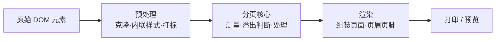

# 前端打印分页技术探讨与 PrintomJs 方案

## 一、问题背景

浏览器原生打印的局限：
- 无法精确控制分页位置
- 表格跨页时表头不重复
- 图片可能被拦腰截断
- Flex/Grid 布局内容分页异常
- 缺少统一的页眉页脚机制

要解决这些问题，通常的思路是：**在打印前，手动把内容切分成一页一页。**

---

## 二、市面上的常见方案对比

| 方案 | 原理 | 优点 | 缺点 |
|------|------|------|------|
| **原生 `window.print()`** | 直接调用浏览器打印 | 简单、零依赖 | 分页不可控、样式易丢失 |
| **CSS `@media print`** | 用 CSS 控制打印样式 | 标准方案、简单 | 只能调样式，无法精确控制分页 |
| **`page-break-*` CSS 属性** | 强制分页 | 可控性比纯 CSS 强 | 仅支持简单场景，表格/图片仍会断 |
| **html2canvas + jsPDF** | 截图后转 PDF | 所见即所得，效果稳定 | 性能差、文本不可选中、体积大 |
| **Print.js** | 封装原生打印，增强样式处理 | 简单易用 | 分页能力有限 |
| **PrintomJs（本文方案）** | DOM 级手动分页 + 智能节点处理 | 分页精确、保留可选文本、支持页眉页脚 | 相对重一些 |

---

## 三、整体处理流程



---

## 四、关键技术点

### 1. 测高容器

这是分页系统的基础设施。它需要满足：
- 不可见（`position: absolute; left: -9999px`）
- 尺寸与打印页面一致
- 样式环境与最终渲染一致

```javascript
// 伪代码：创建测高容器
function createProbeContainer(pageConfig) {
  const container = document.createElement('div')
  container.style.cssText = `
    position: absolute;
    left: -9999px;
    top: 0;
    width: ${pageConfig.pageWidth}px;
    visibility: hidden;
  `
  document.body.appendChild(container)
  return container
}
```

### 2. 节点类型处理策略

不同类型的节点需要不同的处理策略：

| 节点类型 | 处理方式 |
|---------|---------|
| 文本节点 | 可截断，寻找合适的断点 |
| 图片 | 不可截断，可缩放，或整页移 |
| 表格 | 特殊处理，`<thead>` 每页重复 |
| 块级元素（div/p） | 整体判断，可递归检查子节点 |

### 3. 文本截断算法

文本截断是最复杂的部分。基本思路：

1. 先判断整段文本是否溢出
2. 如果溢出，用二分法寻找截断点
3. 在词/句子边界处截断，避免半个字

```javascript
// 伪代码：文本截断
function splitTextNode(textNode, remainingHeight) {
  const text = textNode.textContent
  let left = 0
  let right = text.length
  
  // 二分查找最大可容纳长度
  while (left < right) {
    const mid = Math.floor((left + right + 1) / 2)
    const part = text.slice(0, mid)
    const height = measureText(part)
    
    if (height <= remainingHeight) {
      left = mid
    } else {
      right = mid - 1
    }
  }
  
  // 尝试在标点/空格处回退，获得更自然的断点
  const breakPoint = findNaturalBreak(text, left)
  
  return {
    part1: text.slice(0, breakPoint),
    part2: text.slice(breakPoint)
  }
}
```

### 4. 图片缩放策略

图片处理需要权衡：是牺牲一点清晰度塞进当前页，还是留白移到下页？

通常的策略：
- 计算当前页剩余空间比例
- 如果剩余空间超过阈值（如 40%），尝试缩放
- 缩放后的宽度不能小于最小比例（如 30%）
- 否则移到下一页

### 5. Hook 系统

实际项目中，用户往往需要在分页流程中插入自定义逻辑。一个设计良好的 Hook 系统能提供很大灵活性：

```javascript
// 伪代码：Hook 系统
const hooks = {
  onBeforeParse(content) { /* 修改原始 DOM */ },
  onAfterParse(content) { /* 调整预处理结果 */ },
  onFilter(node) { /* 返回 false 跳过节点 */ },
  onBeforePageLayout(page, index) { /* 页面创建后 */ },
  onAfterPageLayout(page, index) { /* 页面填充后，可加水印 */ },
  onAfterChunked(pages) { /* 全部分页完成 */ }
}
```

---

## 五、PrintomJs 方案介绍

**PrintomJs** 是基于上述思路实现的一个零依赖打印库。

### 快速使用

```javascript
import PrintomJs from 'printom-js'
import 'printom-js/print.css'

const printer = new PrintomJs({
  element: '#content',
  paper: 'A4',
  margin: 15,
  header: { right: '机密文件' },
  footer: { center: '第 {current} / {total} 页' }
})

await printer.exec()
```

### 主要特性

| 特性 | 说明 |
|------|------|
| 智能分页 | DOM 级手动分页，表格/图片处理友好 |
| 页眉页脚 | 支持 `{current}`/`{total}` 变量 |
| 纸张配置 | A3/A4/A5/Letter/Legal + 自定义尺寸 |
| 图片策略 | 可配置缩放阈值，避免过度压缩 |
| 重复表头 | 自动识别 `<thead>` 并每页重复 |
| 完整 Hooks | 15+ 个生命周期钩子 |

### 核心 API

```javascript
// 创建实例
const printer = new PrintomJs(options)

// 预览
await printer.preview('#container')

// 打印
await printer.exec()

// 更新内容
document.getElementById('content').innerHTML = '新内容'
await printer.update()

// 销毁
printer.destroy()
```

---

## 六、总结

前端打印分页的核心挑战在于：
- 在不影响用户页面的情况下测量内容
- 处理不同类型节点的溢出
- 在"完美"和"可用"之间找到平衡

没有银弹，需要根据具体场景选择策略。但一个好的抽象（分阶段处理 + Hook 系统）能让解决方案更优雅、可扩展。

---

## 项目地址

GitHub: [https://github.com/zhoumao1/PrintomJs](https://github.com/zhoumao1/PrintomJs)

文档: [https://zhoumao1.github.io/PrintomJs/](https://zhoumao1.github.io/PrintomJs/)
